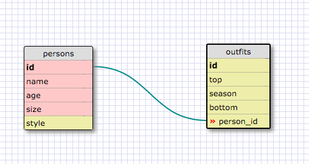

1. SELECT * FROM states;

2. SELECT * FROM regions;

3. SELECT state_name, population FROM states;

4. SELECT state_name, population FROM states ORDER BY population DESC;

5. SELECT state_name FROM states WHERE region_id = 7;

6. SELECT state_name, population_density FROM states WHERE population_density > 50 ORDER BY population_density ASC;

7. SELECT state_name FROM states WHERE population BETWEEN 1000000 AND 1500000;

8. SELECT state_name, region_id FROM states ORDER BY region_id ASC;

9. SELECT region_name FROM regions WHERE region_name LIKE '%central%';

10. SELECT regions.region_name, states.state_name FROM regions JOIN states ON regions.id = states.region_id;

REFLECTION:

What are databases for?
  - To information in such a way that it can be access, organized, and manipulated.

What is a one-to-many relationship?
  - when one element of data belongs to only a second element, but the second element can have many other elements that belong to it.

What is a primary key? What is a foreign key? How can you determine which is which?
  -a primary key is a unique id given for an element in the current table. A foreign key is the unique id related to the primary key, but listed on a different table related to the first one.

How can you select information out of a SQL database? What are some general guidelines for that?
  - using database syntax you can select elements by manipulating their fields(columns). They can be ordered, grouped, calculated, and even joined by another related table.