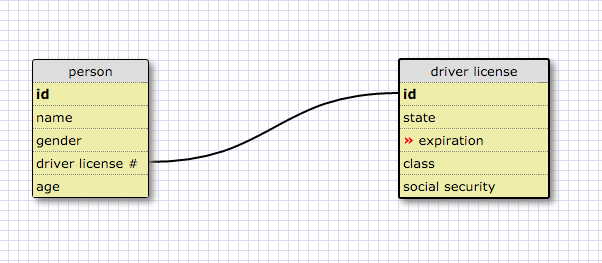
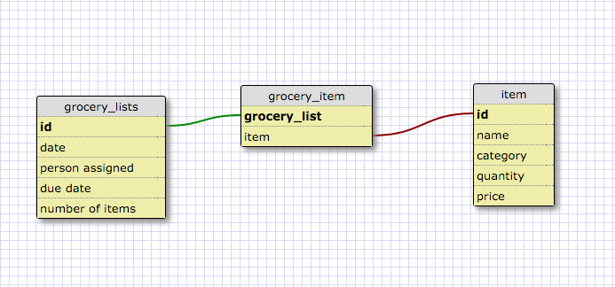

RELEASE 2:
One-to-one Relationship

This is a one-to-one relationship because a person can only have one driver license number and the number can only belong to one person.

RELEASE 3:
Many-to-many Relationship

REFLECTION:

What is a one-to-one database?
- when one entity only has a connection to one other entity and vice-versa.

When would you use a one-to-one database? (Think generally, not in terms of the example you created).
- when one entity only has a connection to one other entity and vice-versa.

What is a many-to-many database?
- when an entity is connected to many other entities, and the latter entity is connected to many other enitities.

When would you use a many-to-many database? (Think generally, not in terms of the example you created).
- when an entity is connected to many other entities, and the latter entity is connected to many other enitities.

What is confusing about database schemas? What makes sense?
- The concept is pretty easy to understand. I am interested in seeing the application of these relationships.
